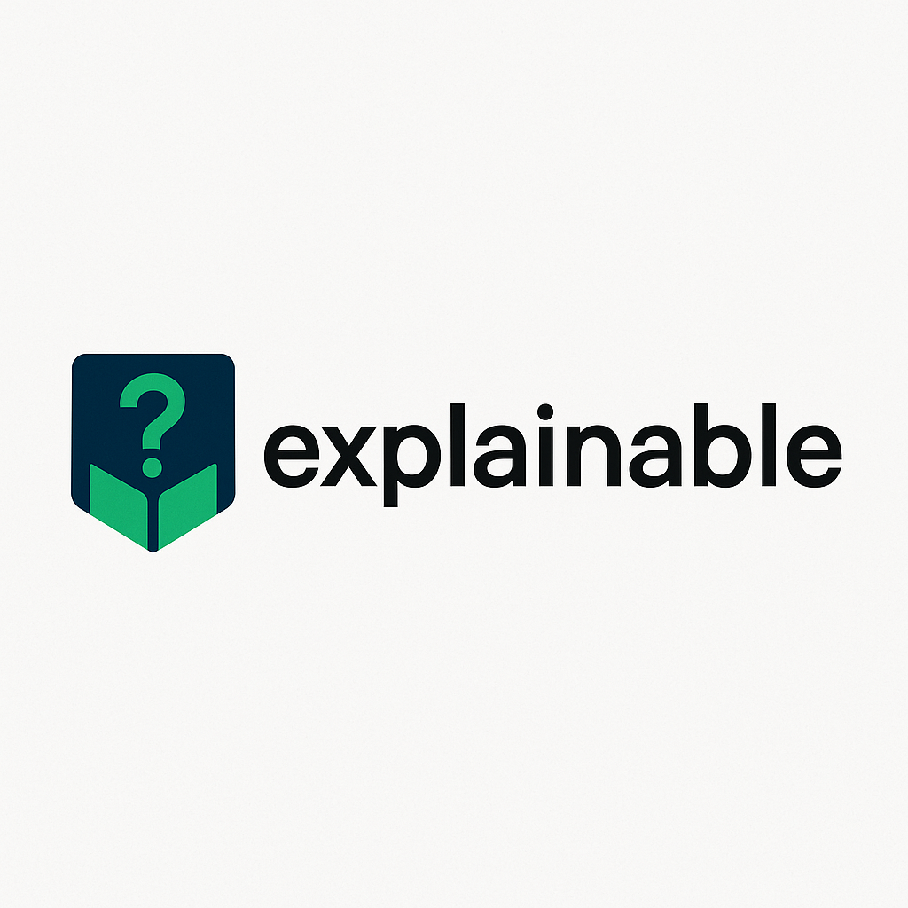

# explainable

<p align="center">
  
</p>

<h1 align="center">explainable</h1>

<p align="center">
  A reflection-based utility to describe Go structs and slices using metadata.
</p>

<p align="center">
  <a href="https://github.com/aristorap/explainable/tags"></a>
  <a href="https://github.com/aristorap/explainable/actions/workflows/ci.yml"></a>
  <a href="https://goreportcard.com/report/github.com/aristorap/explainable"></a>
  <a href="https://pkg.go.dev/github.com/aristorap/explainable"></a>
  <a href="LICENSE"></a>
</p>

---

`explainable` is a Go package that helps describe structs and their fields with metadata. It uses reflection to provide an easy-to-understand explanation of the structure of structs, slices, and other types in your Go code.

The package automatically generates a description for each field, allowing developers to understand the structure and metadata associated with the fields of their Go types.

## Features

- **Structs**: Describes the fields of the struct along with their JSON and explanation tags.
- **Slices**: Describes slices and their elements. If the elements are structs, a representative element is explained.
- **Pointers**: The package handles struct pointers, explaining their underlying values.
- **Custom Tags**: Allows custom explanations via the `explain` tag, making it easy to provide context for each field.
- **Recursion**: Nested structs are recursively explained to give a comprehensive view of the data structure.
- **HTTP Response**: Provides a convenient `Respond` function to return either raw data or its explanation based on a query param (`?explain=true`).

## Tags

The package relies on the following tags:

- `json`: Used to indicate the JSON field name.
- `explain`: Used to provide a description of the field.

### Example of Tags

```go
type Example struct {
	Field1 string `json:"field1" explain:"First field description"`
	Field2 int    `json:"field2" explain:"Second field description"`
}
```


## Installation

To install the `explainable` package, run the following Go command:

```bash
go get github.com/aristorap/explainable
```

## Usage

### Example 1: Explaining a Struct

```go
package main

import (
	"fmt"
	"github.com/aristorap/explainable"
)

type User struct {
	ID    int    `json:"id" explain:"The unique identifier"`
	Name  string `json:"name" explain:"The name of the user"`
	Email string `json:"email" explain:"The email address"`
}

func main() {
	user := User{
		ID:    1,
		Name:  "John Doe",
		Email: "john.doe@example.com",
	}

	// Get the explanation of the User struct
	explanation := explainable.Explain(user)
	fmt.Printf("%+v", explanation)
```

#### Example 1: Response (Marshalled to JSON)

```JSON
{
  "email": {
    "description": "The email address",
    "type": "string"
  },
  "id": {
    "description": "The unique identifier",
    "type": "int"
  },
  "name": {
    "description": "The name of the user",
    "type": "string"
  }
}
```

### Example 2: Explaining a Slice of Structs

```go
package main

import (
	"fmt"
	"github.com/aristorap/explainable"
)

type Product struct {
	ID   int    `json:"id" explain:"Product identifier"`
	Name string `json:"name" explain:"Product name"`
}

func main() {
	products := []Product{
		{ID: 1, Name: "Laptop"},
		{ID: 2, Name: "Phone"},
	}

	// Get the explanation of the slice of Products
	explanation := explainable.Explain(products)
	fmt.Printf("%+v", explanation)
}
```

#### Example 2: Response (Marshalled to JSON)

```JSON
{
  "description": "List of results",
  "results": [
    {
      "id": {
        "description": "Product identifier",
        "type": "int"
      },
      "name": {
        "description": "Product name",
        "type": "string"
      }
    }
  ]
}
```

### Example 3: Serving Explanation in HTTP

```go
package main

import (
	"net/http"
	"github.com/aristorap/explainable"
)

type Article struct {
	Title   string `json:"title" explain:"Article title"`
	Content string `json:"content" explain:"Main content"`
	Author  string `json:"author" explain:"Author name"`
}

func handler(w http.ResponseWriter, r *http.Request) {
	data := Article{
		Title:   "Using explainable in Go",
		Content: "This article explains how to use the explainable package...",
		Author:  "Jane Doe",
	}

  // If params include 'explain=true'
  // Respond will send over the explained data
  // Else it will respond with the data
	explainable.Respond(w, r, data)
}

func main() {
	http.HandleFunc("/article", handler)
	http.ListenAndServe(":8080", nil)
}
```

#### Example 3.1: GET /article

```JSON
{
  "title":"Using explainable in Go",
  "content":"This article explains how to use the explainable package...",
  "author":"Jane Doe"
}
```

#### Example 3.2: GET /article?explain=true

```JSON
{
  "data":{
    "author": {
      "description": "Author name",
      "type": "string"
    },
    "content": {
      "description": "Main content",
      "type": "string"
    },
    "title": {
      "description": "Article title",
      "type": "string"
    }
  }
}
```

## Error Handling

The package uses Go's `reflect` package, so in case of unexpected values or types, it recovers from panics and returns an empty explanation instead of crashing your program.

## Contribution

Contributions are welcome! Feel free to open issues or submit pull requests to improve the package. Ensure that tests are included for new features or bug fixes.

## License

`explainable` is licensed under the MIT License. See the [LICENSE](LICENSE) file for more information.
